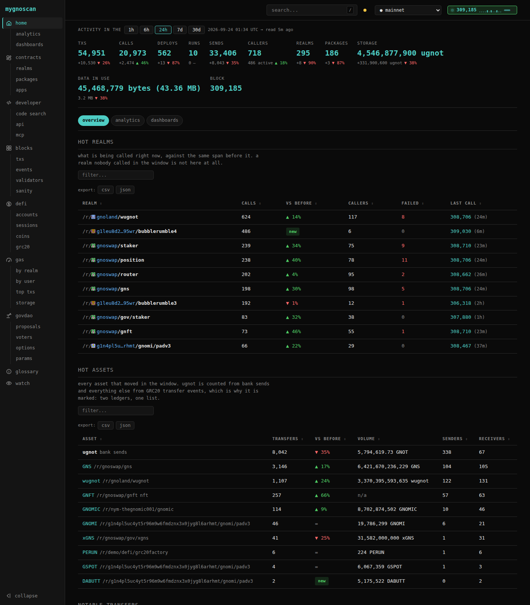
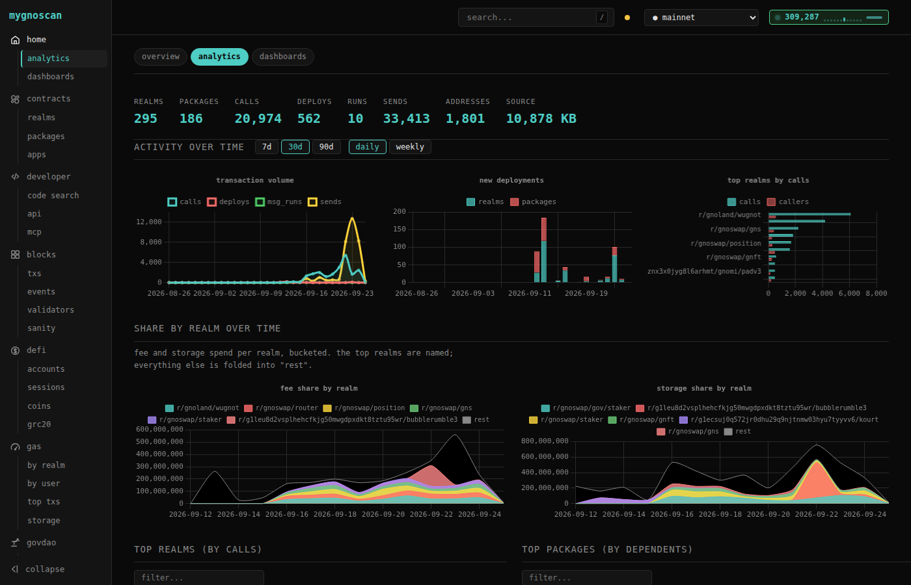
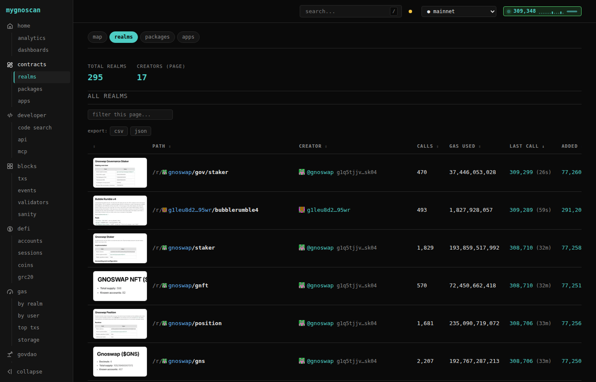
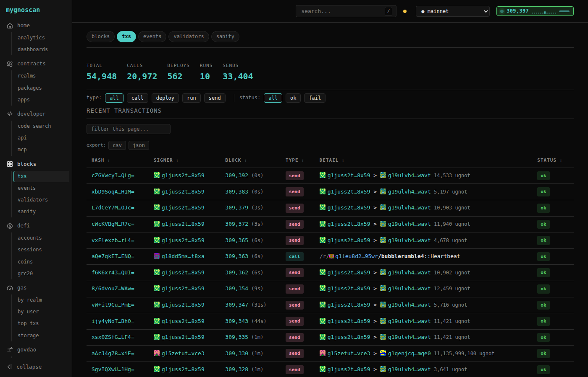
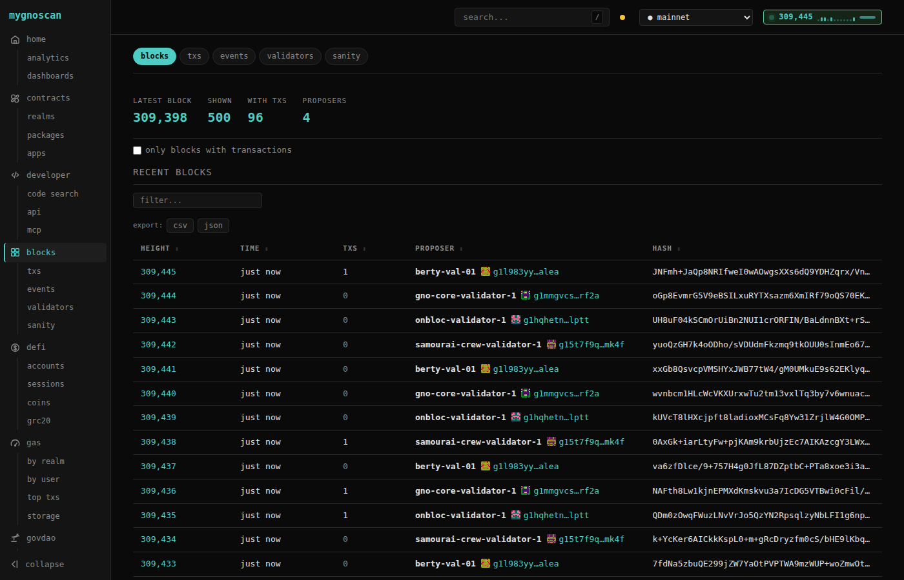

# mygnoscan

A fast, minimal block explorer for [gno.land](https://gno.land) — built around the
question generic explorers answer badly: **what code is deployed, what does it
import, and who actually calls it?**

Transactions and blocks are table stakes. The dependency and usage graph between
realms is the point.



## What it does

- **Realm inspector** — source, imports, dependents, callers, MsgRun references
- **Dependency graph** — interactive D3 view of what imports what
- **Usage tracking** — direct calls, indirect imports, MsgRun references
- **Multi-network** — several chains in one instance and one database, switchable
- **Analytics** — activity over time, gas, storage growth, leaderboards
- **Single binary** — Go backend with the frontend embedded, no Node.js



Built on the [tx-indexer](https://github.com/gnolang/tx-indexer) GraphQL API, with
a local SQLite cache for the dependency analysis.

## Quick start

```bash
make install
mygnoscan
# http://localhost:8888
```

Point it at one network:

```bash
mygnoscan -indexer https://indexer.pearl.testnets.gno.land/graphql/query -network pearl
```

…or several, with a config file:

```bash
mygnoscan -config networks.json
```

With Docker:

```bash
docker run -p 8888:8888 ghcr.io/gnoverse/mygnoscan:main
```

## Documentation

Everything lives in [`docs/`](docs/) — start there.

| | |
|---|---|
| [docs/spec.md](docs/spec.md) | what mygnoscan is, the data model, how networks are scoped |
| [docs/architecture.md](docs/architecture.md) | components, data flow, design decisions, known weak points |
| [docs/api.md](docs/api.md) | full `/api/*` reference |
| [docs/development.md](docs/development.md) | local development loop |
| [docs/deployment.md](docs/deployment.md) | flags, config, operating notes |
| [docs/screenshots.md](docs/screenshots.md) | regenerating the images above |
| [CONTRIBUTING.md](CONTRIBUTING.md) | how to contribute |
| [AGENTS.md](AGENTS.md) | conventions and invariants for code changes |

## More views

<details>
<summary>Realms, transactions, blocks</summary>







</details>
